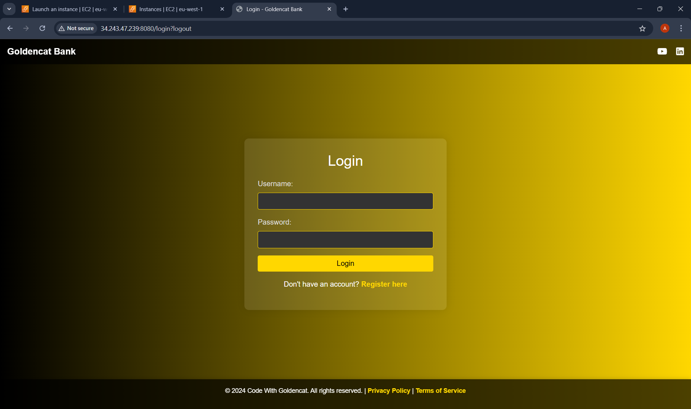
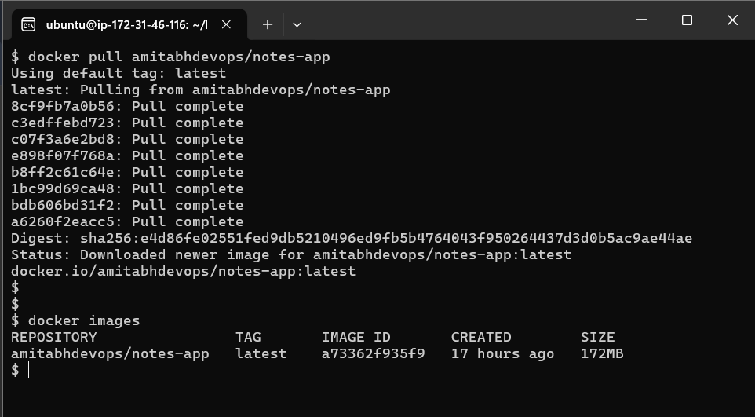
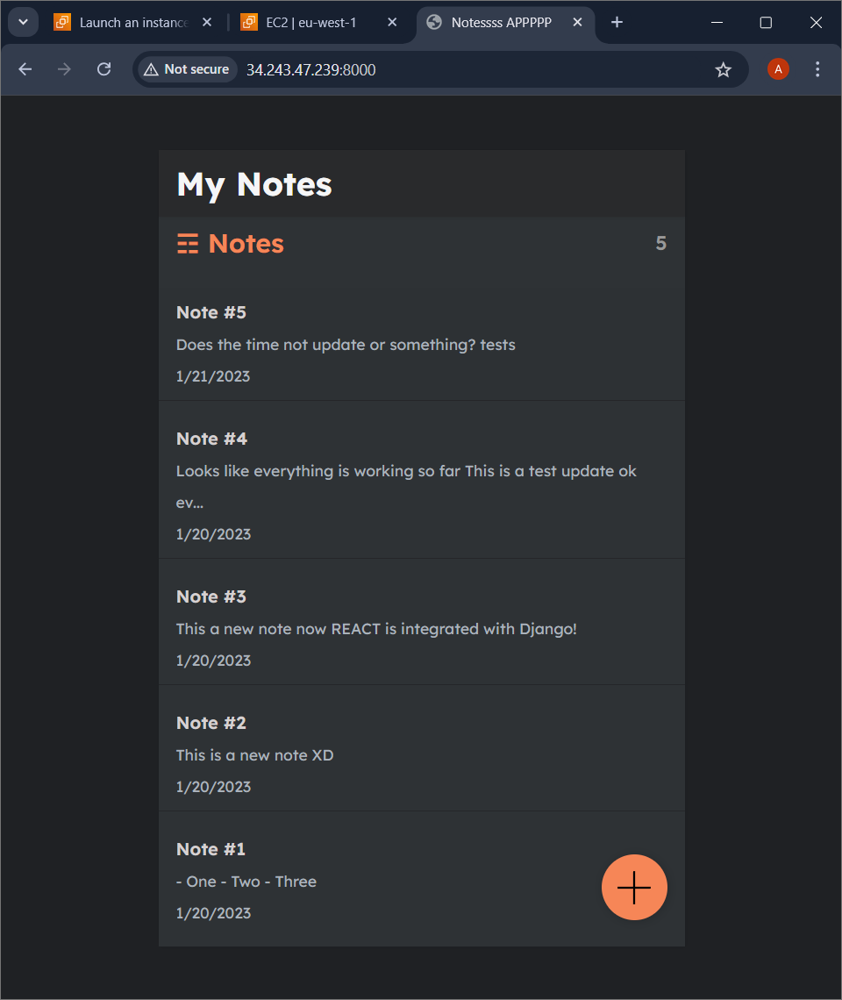
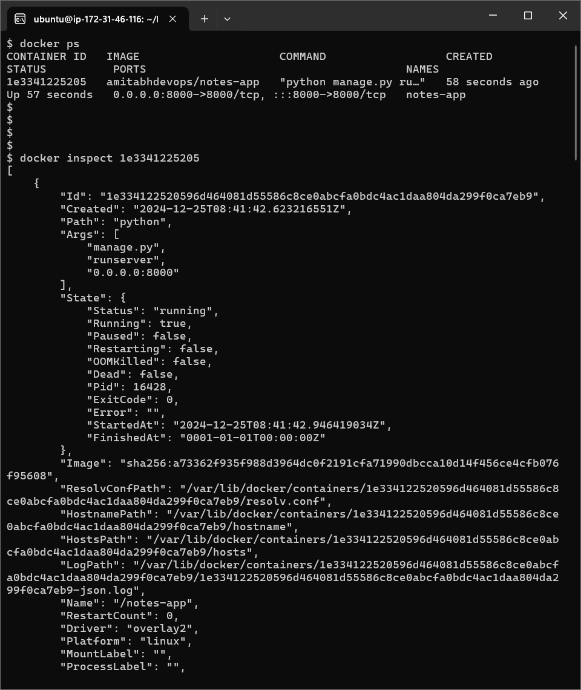
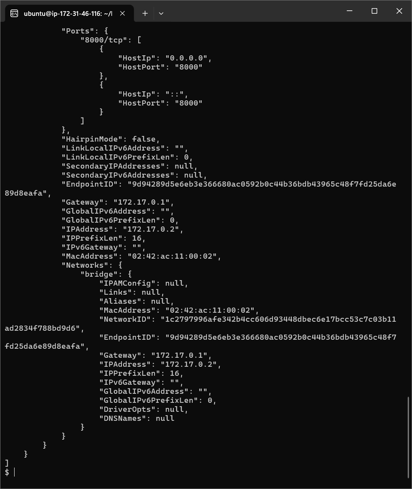
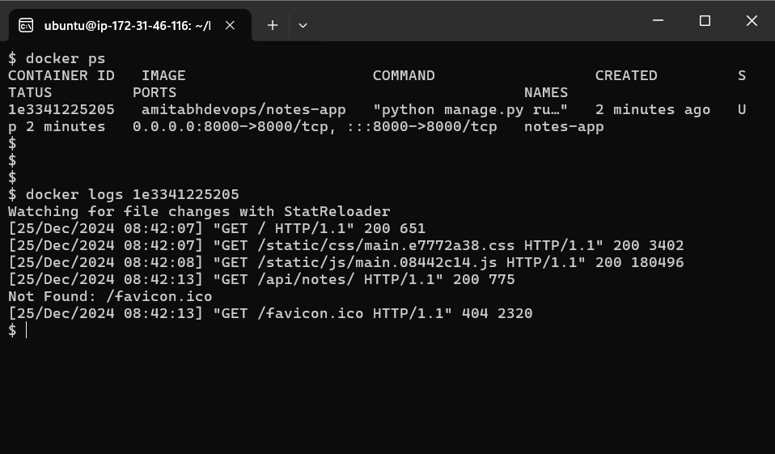
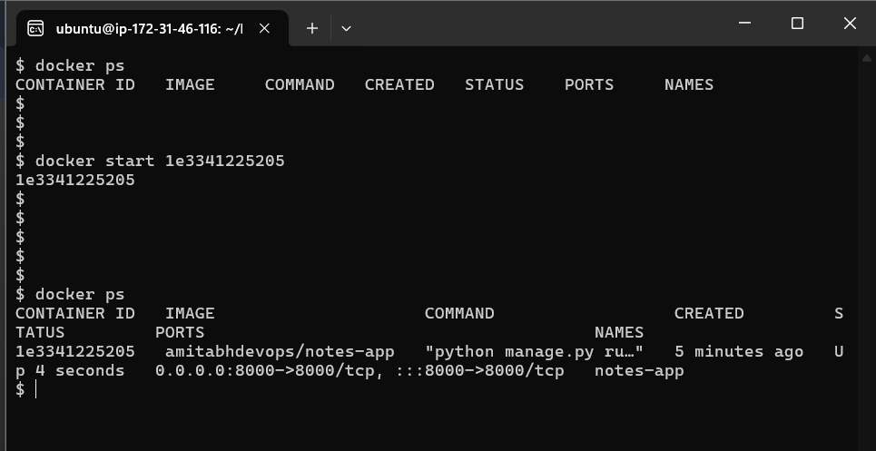
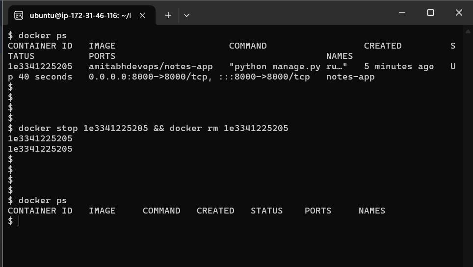

# Day 18 Answers:  Docker for DevOps Engineers

Till now you have created a Dockerfile and pushed it to the repository. Let's move forward and dig deeper into other Docker concepts. Today, let's study Docker Compose! 😃

## Docker Compose

- Docker Compose is a tool that was developed to help define and share multi-container applications.
- With Compose, we can create a YAML file to define the services and, with a single command, spin everything up or tear it all down.
- Learn more about Docker Compose [here](https://tecadmin.net/tutorial/docker/docker-compose/).

## What is YAML?

- YAML is a data serialization language that is often used for writing configuration files. Depending on whom you ask, YAML stands for "Yet Another Markup Language" or "YAML Ain’t Markup Language" (a recursive acronym), which emphasizes that YAML is for data, not documents.
- YAML is a popular programming language because it is human-readable and easy to understand.
- YAML files use a .yml or .yaml extension.
- Read more about it [here](https://www.redhat.com/en/topics/automation/what-is-yaml).


## Tasks with Solutions

## Task 1

Learn how to use the docker-compose.yml file to set up the environment, configure the services and links between different containers, and also to use environment variables in the docker-compose.yml file.

[Sample docker-compose.yml file](https://github.com/LondheShubham153/90DaysOfDevOps/blob/master/2023/day18/docker-compose.yaml)


**Solution :**

   1. Clone this repo:

      `https://github.com/LondheShubham153/Springboot-BankApp.git`

   2. Dockerfile:

      ```bash
      #----------------------------------
      # Stage 1
      #----------------------------------

      # Import docker image with maven installed
      FROM maven:3.8.3-openjdk-17 as builder

      # Set working directory
      WORKDIR /app

      # Copy source code from local to container
      COPY . /app

      # Build application and skip test cases
      RUN mvn clean install -DskipTests=true

      #--------------------------------------
      # Stage 2
      #--------------------------------------

      # Import small size java image
      FROM openjdk:17-alpine as deployer

      # Copy build from stage 1 (builder)
      COPY --from=builder /app/target/*.jar /app/target/bankapp.jar

      # Expose application port
      EXPOSE 8080

      # Start the application
      ENTRYPOINT ["java", "-jar", "/app/target/bankapp.jar"]
      ```

   3. Build the image using this Dockerfile

   4. Run the container using the image built in the above step.

   5. Sample output:

      

      


### Task 2: Running a Container as a Non-Root User

1. **Creating a User**: I have created a user called `amitabh` and added them to the Docker group, which allows Docker commands to be executed without `sudo`.
   - The `usermod` command and reboot are important steps to ensure that the changes take effect (You can use this command `newgrp docker` to avoid instance reboot).

      

      


2. **Using the Custom Image (`amitabhdevops/notes-app`)**: 

   - Pull the custom image:
     ```bash
     docker pull amitabhdevops/notes-app
     ```

      


   - Run the container as `amitabh`:
     ```bash
     docker run -d -p 8000:8000 --name notes-app amitabhdevops/notes-app
     ```

      

   
   - Output : 

      
      


3. **Inspecting the Container**: After running the container, you can inspect it:

   ```bash
   docker inspect notes-app
   ```

      

      


4. **Viewing Logs**: To see the container logs, you can use:

   ```bash
   docker logs notes-app
   ```
   
      


5. **Stopping and Starting the Container**:

   - To stop:
     ```bash
     docker stop notes-app
     ```

         


   - To start:
     ```bash
     docker start notes-app
     ```

      


6. **Removing the Container**: Once you're done, you can remove the container:

   ```bash
   docker stop notes-app && docker rm notes-app  # You can use either Container ID or Container name
   ```

      


For reference, you can watch this [video](https://youtu.be/Tevxhn6Odc8).


[Linkedin](https://www.linkedin.com/in/amitabh-devops/)
