# **Setting Up CI/CD Pipeline with AWS CodeBuild and CodeDeploy for a Node.js Application**


## **Prerequisites**

Before we begin, here are a few things you need to get started:

1. **AWS Account:** You’ll need an AWS account with administrator access. If you don’t have one, create a free-tier AWS account [here](https://aws.amazon.com/).
    
2. **Node.js Application:** A Node.js application hosted on [GitHub](https://github.com/Amitabh-DevOps/Project-03-Jenkins-CI-CD-Project-Todo-node-app). We will use the `feat/awscicd` branch of the app.
    
3. **Basic AWS Knowledge:** Basic understanding of AWS services like IAM, EC2, CodePipeline, and S3.
    
4. **Ubuntu EC2 Instance:** We will use an EC2 instance running Ubuntu as our deployment target.
    

---

## **Step 1: Create an IAM User and Set Up CLI Access**

In this step, we'll create an IAM user that allows us to interact with AWS services via the command line interface (CLI).

### **Create an IAM User**

1. Go to the **IAM Management Console**.
    
2. Click **Users** &gt; **Add users**.
    
3. Enter a username (e.g., `codepipeline-user`).
    
4. Attach the following policies to this user to allow access to necessary AWS services:
    
    * `AWSCodePipelineFullAccess`: Full access to AWS CodePipeline.
        
    * `AWSCodeDeployFullAccess`: Full access to AWS CodeDeploy.
        
    * `AmazonS3FullAccess`: Full access to S3 buckets.
        
    * `AWSCodeBuildAdminAccess`: Full access to AWS CodeBuild.
        
    * or else provide `AdministratorAccess` then no need to provide above access.
        
5. Download the **Access Key** and **Secret Key** for later use.
    
6. Login with that **IAM User** Now.
    
7. 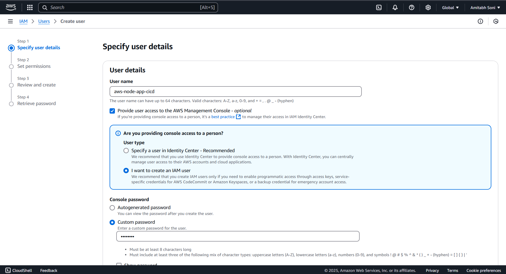
    
---

## **Step 2: Launch and Prepare the Ubuntu EC2 Instance**

Now, we’ll set up an Ubuntu EC2 instance to deploy the application.

### **Launch EC2 Instance**

1. Open the **EC2 Management Console** and click **Launch Instance**.
    
2. Choose the **Ubuntu Server 22.04 LTS** AMI.
    
3. Select **t2.micro** instance type (eligible for the free tier).
    
4. Choose an existing key pair or create a new one to access the instance via SSH.
    
5. Click on Launch instance.
    
    
    

### **Prepare the Instance**

1. Connect to your EC2 instance using SSH:
    
    ```bash
    ssh -i <your-key.pem> ubuntu@<instance-ip>
    ```
    
2. Update and install dependencies:
    
    ```bash
    sudo apt update
    sudo apt install ruby-full
    sudo apt install wget
    ```
    
3. Install the CodeDeploy agent:
    
    ```bash
    wget https://aws-codedeploy-us-east-1.s3.us-east-1.amazonaws.com/latest/install
    sudo chmod +x ./install
    sudo ./install auto
    sudo service codedeploy-agent start
    ```
    
4. Verify the agent is running:
    
    ```bash
    sudo service codedeploy-agent status
    ```
    
    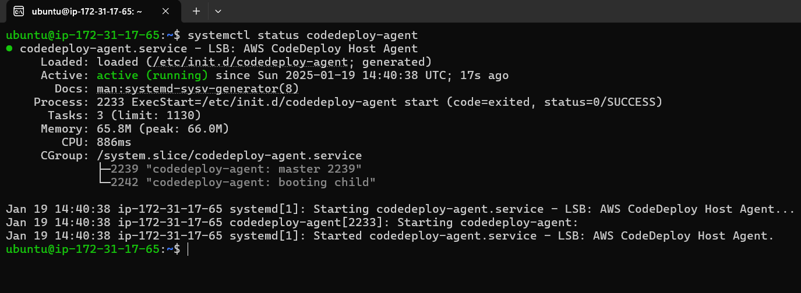
    
5. Attach an IAM role with the following policies to the Created Instance:
    
    1. create a IAM role with any name for EC2 instance ,which having this permissions :
        
        * `AmazonEC2RoleforAWSCodeDeploy`: Necessary for EC2 to interact with AWS CodeDeploy.
            
        * `AmazonS3FullAccess`: Full access to S3 for artifact storage.
            
        * `AmazonEC2FullAccess`: Full access to EC2 for managing the instance.
            
    2. Go to console and select instance → Actions → security → Modify IAM role and select the IAM role which you have created
        
6. Then restart the agent and check the status of codedeploy-agent:
    
    ```bash
    sudo service codedeploy-agent restart
    ```
    
7. Install docker also and setup with that also.
    
    ```bash
    sudo apt install docker.io -y
    
    sudo usermod -aG docker && newgrp docker
    ```
    

### **Configure AWS CLI**

The AWS CLI allows us to interact with AWS services from the terminal.

1. Install AWS CLI on your local machine:
    
    ```bash
    sudo apt update
    sudo apt install awscli -y
    ```
    
2. Configure the CLI:
    
    ```bash
    aws configure
    ```
    
    When prompted, enter the **Access Key**, **Secret Key**, default region (e.g., `us-east-1`), and output format (e.g., `json`).
    

---

## **Step 3: Configure S3 for Artifact Storage**

In CI/CD, we need a place to store build artifacts. AWS S3 is perfect for this.

1. Go to the **S3 Management Console**.
    
2. Create a new S3 bucket (e.g., `my-codepipeline-artifacts`).
    
3. Note down the bucket name and region for later use.
    
4. 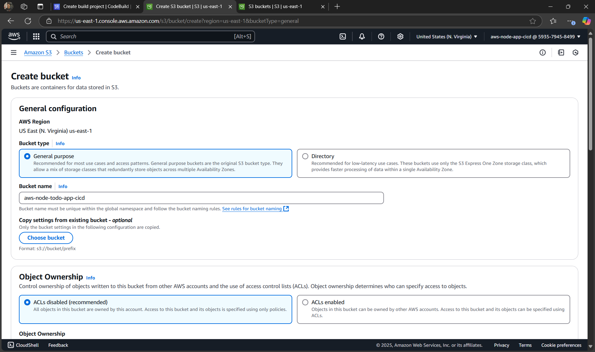
    

---

## **Step 4: Set Up AWS CodeBuild**

AWS CodeBuild compiles your source code, runs tests, and produces artifacts for deployment. It’s a key service in the CI/CD pipeline.

  
**Firstly** **Store Docker Credentials in AWS Systems Manager Parameter Store**

1. **Navigate to AWS Systems Manager**:
    
    * In the **AWS Console**, go to **Systems Manager** (you can find it under the **Management & Governance** section).
        
2. **Go to Parameter Store**:
    
    * Under **Application Management**, click on **Parameter Store**.
        
3. **Create Parameters**:
    
    * Click on **Create parameter** to add a new parameter.
        
    * **Parameter Name**: Set the name for the parameter. For example:
        
        * `/myapp/docker-credentials/username`
            
        * `/myapp/docker-credentials/password`
            
        * `/myapp/docker-registry/url`
            
    * **Type**: Choose **SecureString** (to encrypt the value).
        
    * **Value**: Enter the actual values for your Docker registry credentials:
        
        * **Username**: Your Docker Hub username (e.g., `your-dockerhub-username`).
            
        * **Password**: Your Docker Hub password or token (e.g., `your-dockerhub-password`).
            
        * **Registry URL**: For Docker Hub, this will be [`https://index.docker.io/v1/`](https://index.docker.io/v1/) or similar.
            
    * **Click Create** to save each parameter.
        
    * 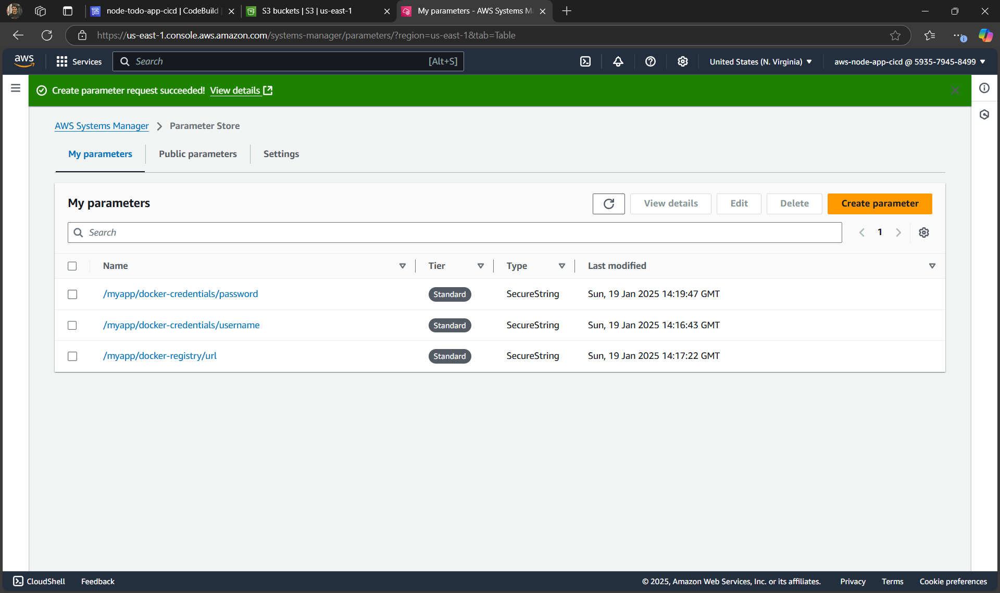
        

### **Create a CodeBuild Project**

1. Go to the **AWS CodeBuild Console** and click **Create project**.
    
2. Enter a project name (e.g., `nodejs-build-project`).
    
3. Under **Source**, choose **GitHub** and link your GitHub repository.
    
4. In the **Environment** section, choose **Ubuntu** as the environment image.
    
5. For the **Service role**, select the option to **create an new role** and create that Role.
    
6. Assign that role the permission of `AmazonSSMFullAccess` and use it to use **env** of buildspec it need that permissions.
    
    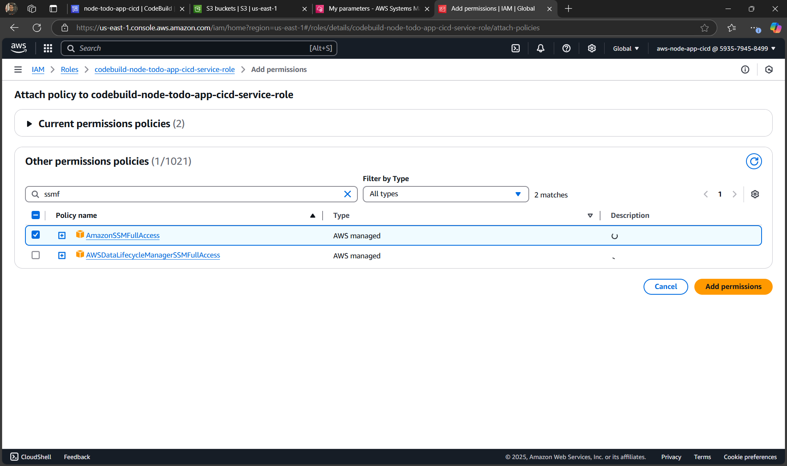
    
7. In Artifact use that created bucket .
    
    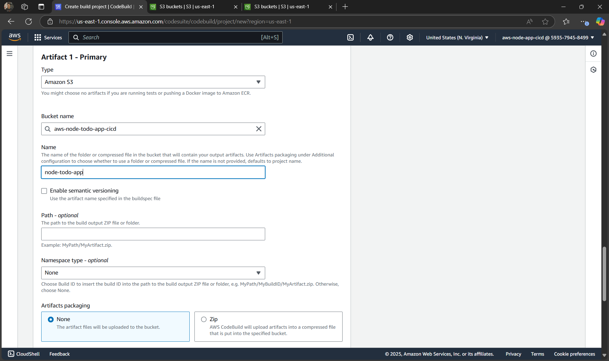
    
8. Check the CloudWatch and S3 logs.
    
    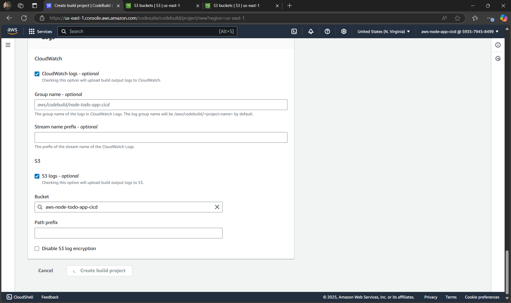
    
9. Use a **buildspec.yml** file in your repository.
    
10. `buildspec.yml`:
    
    ```yaml
    version: 0.2
    
    env:
      parameter-store:
        DOCKER_REGISTRY_USERNAME: /myapp/docker-credentials/username
        DOCKER_REGISTRY_PASSWORD: /myapp/docker-credentials/password
        DOCKER_REGISTRY_URL: /myapp/docker-registry/url
    
    phases:
      install:
        runtime-versions:
          nodejs: 12.2.0
        commands:
          - echo Installing Node.js and npm...
          - n 12.2.0
          - npm config set registry https://registry.npmjs.org/
          
      pre_build:
        commands:
          - echo Logging in to Docker Registry...
          - echo "$DOCKER_REGISTRY_PASSWORD" | docker login -u "$DOCKER_REGISTRY_USERNAME" --password-stdin "$DOCKER_REGISTRY_URL"
          - IMAGE_REPO_NAME="aws-node-todo-app-cicd"
          - IMAGE_NAME="$DOCKER_REGISTRY_URL/$DOCKER_REGISTRY_USERNAME/$IMAGE_REPO_NAME"
          - IMAGE_TAG=v1
          
      build:
        commands:
          - echo Build started on `date`
          - echo Packaging application into a zip file...
          - zip -r node-todo-app.zip * .[^.]* # Include all files and directories, including hidden files
          - echo Building the Docker image...
          - docker build -t $IMAGE_NAME:latest .
          - docker tag $IMAGE_NAME:latest $IMAGE_NAME:$IMAGE_TAG
          
      post_build:
        commands:
          - echo Build completed on `date`
          - echo Pushing the Docker image...
          - docker push $IMAGE_NAME:latest
          - docker push $IMAGE_NAME:$IMAGE_TAG
          - echo Uploading zip file to S3 root location...
          - aws s3 cp node-todo-app.zip s3://aws-node-todo-app-cicd/node-todo-app/ # Upload zip file to the root of the bucket
          - echo Writing image definitions file...
          - printf '{"ImageURI":"%s", "Port":8000}' $IMAGE_NAME:$IMAGE_TAG > imageDefinitions.json
          - cat imageDefinitions.json
    
    artifacts:
      files:
        - '**/*'
      base-directory: '.'
      discard-paths: no
      exclude-patterns:
        - 'node_modules/**/*'
        - '.git/**/*'
        - '.gitignore'
        - 'README.md'
        - 'package-lock.json'
    ```
    

### **Explanation of** `buildspec.yml`:

* **Install Phase**: Installs Node.js and npm.
    
* **Pre-Build Phase**: Logs into Docker Hub using credentials stored in the AWS Parameter Store.
    
* **Build Phase**: Packages the Node.js app, builds the Docker image, and tags it.
    
* **Post-Build Phase**: Pushes the image to Docker Hub, uploads the app zip file to S3, and writes the image definition for CodeDeploy.
    

---

## **Trigger CodeBuild:**

* Once CodeBuild completes successfully, it will push the Docker image to DockerHub and upload the zip file to S3.
    
* Build success :
    
    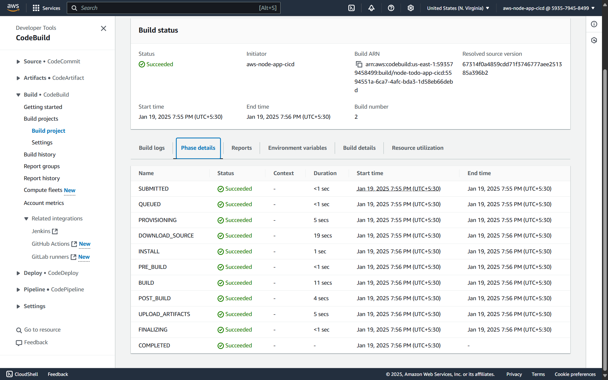
    
* DockerHub varification of Image is pushed or not :
    
    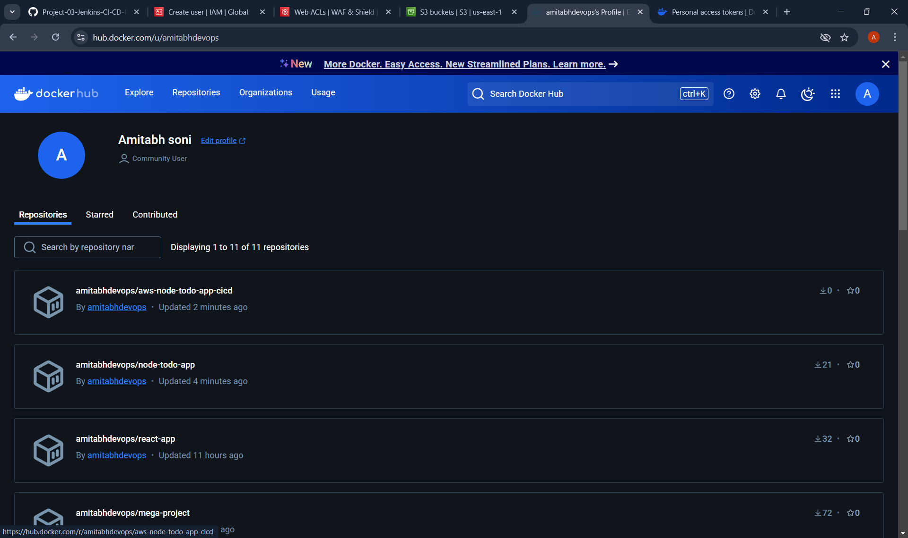
    
* Checking content of S3 bucket :
    
    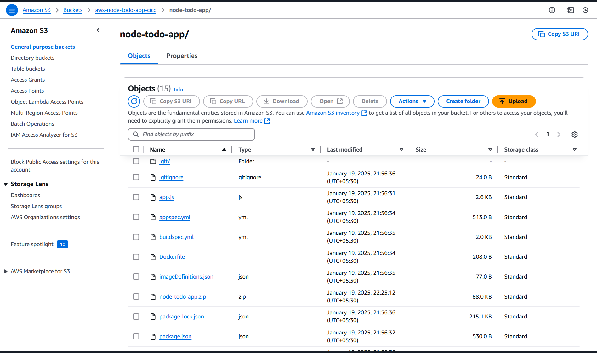
    

---

## **Step 5: Set Up AWS CodeDeploy**

CodeDeploy automates the deployment of your application to the EC2 instance.

### **1\. Prepare AppSpec and Scripts**

In your GitHub repository, add the following configuration files for CodeDeploy:

* **appspec.yml**:
    
    ```yaml
    version: 0.0
    os: linux
    files:
      - source: /
        destination: /home/ubuntu/node-todo-app
        overwrite: true
    file_exists_behavior: OVERWRITE
    hooks:
      ApplicationStop:
        - location: scripts/stop_container.sh
          timeout: 300
          runas: root
      ApplicationStart:
        - location: scripts/start_container.sh
          timeout: 300
          runas: root
    ```
    
    The `appspec.yml` defines:
    
    * **ApplicationStop**: Stops any running Docker containers before starting a new one.
        
    * **ApplicationStart**: Starts the Docker container from the latest image in Docker Hub.
        
* **scripts/**start\_container.sh:
    
    ```bash
    #!/bin/bash
    set -e
    
    # Pull the latest Docker image from Docker Hub
    docker pull amitabhdevops/aws-node-todo-app-cicd:v1
    
    # Run the Docker image as a container
    docker run -d -p 8000:8000 amitabhdevops/aws-node-todo-app-cicd:v1
    ```
    
* **scripts/**stop\_container.sh:
    
    ```bash
    #!/bin/bash
    set -e
    
    # Stop any running Docker container
    containerid=$(docker ps -q)
    if [ -n "$containerid" ]; then
      docker stop $containerid && docker rm -f $containerid
    else
      echo "No running containers to remove."
    fi
    ```
    
    These scripts manage the lifecycle of the Docker container.
    

### **2\. Create a CodeDeploy Application**

1. Open the **CodeDeploy Management Console**.
    
2. Click **Applications** &gt; **Create Application**.
    
3. Enter an application name (e.g., `nodejs-app`) and select **EC2/On-Premises** as the compute platform.
    
    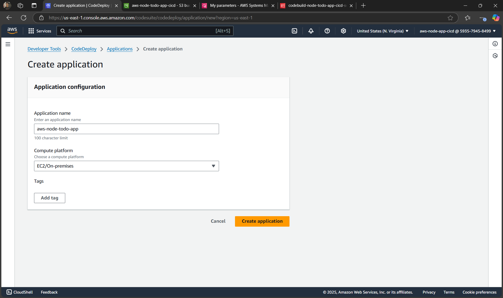
    

### **3\. Create a Deployment Group**

Now, create a **Deployment Group** for your application:

1. **Create Deployment Group**:
    
    * Under your application in **CodeDeploy**, click **Create deployment group**.
        
2. **Name the Deployment Group**:
    
    * Provide a name for the deployment group (e.g., `nodejs-deployment-group`).
        
3. **Select Service Role**:
    
    * Choose the **IAM role** created earlier for EC2.
        
4. **Deployment Type**:
    
    * Choose **In-place deployment** (This will update the application on the EC2 instance).
        
5. **Environment Configuration**:
    
    * Select **Amazon EC2**.
        
    * Add your EC2 instance either by **instance ID** or **tags**.
        
6. **Deployment Settings**:
    
    * Set the **Deployment Configuration** to **CodeDeployDefault.AllAtOnce** (this updates all instances simultaneously).
        
    * Enable **rollback on failure** to ensure deployment stops if an error occurs.

7. 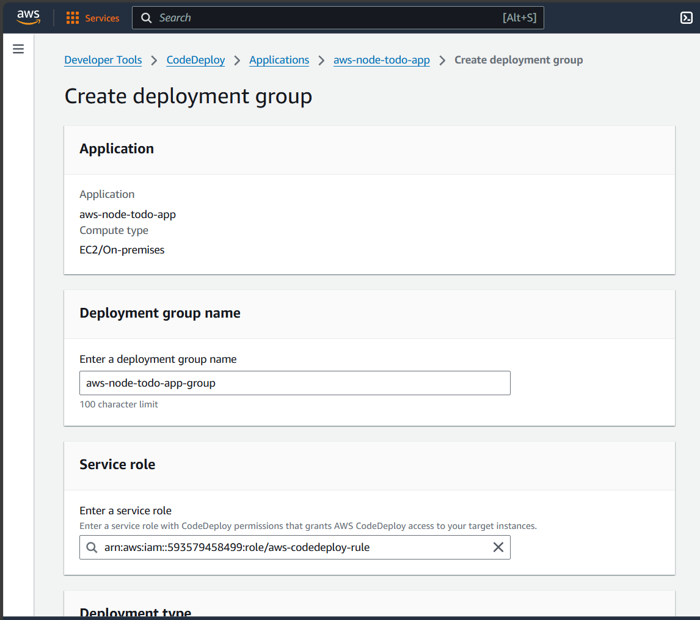
    

### **4\. Create Deployment Under the Deployment Group**

Once the EC2 instance and the CodeDeploy Agent are set up, and the application artifacts are ready in S3, it's time to deploy the application using AWS CodeDeploy.

### **Create a Deployment**

1. **Go to the AWS CodeDeploy Console**:
    
    * In the **AWS Console**, navigate to **CodeDeploy**.
        
2. **Select Your Application**:
    
    * In the CodeDeploy dashboard, select the application you created for deployment (e.g., `nodejs-app`).
        
3. **Select the Deployment Group**:
    
    * Choose the **Deployment Group** that you created earlier (e.g., `nodejs-deployment-group`).
        
4. **Create a New Deployment**:
    
    * Click **Create deployment**.
        
5. **Configure Deployment Details**:
    
    * Under **Deployment type**, select **In-place deployment** (to deploy directly to the EC2 instance).
        
    * For **Revision type**, select **Amazon S3**.
        
    * For **Amazon S3 location**, enter the S3 bucket and path where your build artifact is stored. For example:
        
        * S3 bucket: `aws-node-todo-app-cicd`
            
        * S3 path: `node-todo-app/node-todo-app.zip`
            
6. **Set Deployment Configuration**:
    
    * Choose the **Deployment Configuration** (e.g., **CodeDeployDefault.OneAtATime** for one instance at a time or **CodeDeployDefault.AllAtOnce** to deploy to all instances simultaneously).
        
7. **Deployment Group Settings**:
    
    * Ensure the **Deployment Group** is selected.
        
    * Optionally, configure alarms and notifications for deployment events.
        
8. **Deploy**:
    
    * Click **Create deployment** to start the deployment process.
        

---

## **Trigger CodeDeploy**

* AWS CodeDeploy will use the `appspec.yml` file to manage deployment. The deployment scripts will start and stop containers on the target EC2 instances.
    
* Deployment success :
    
    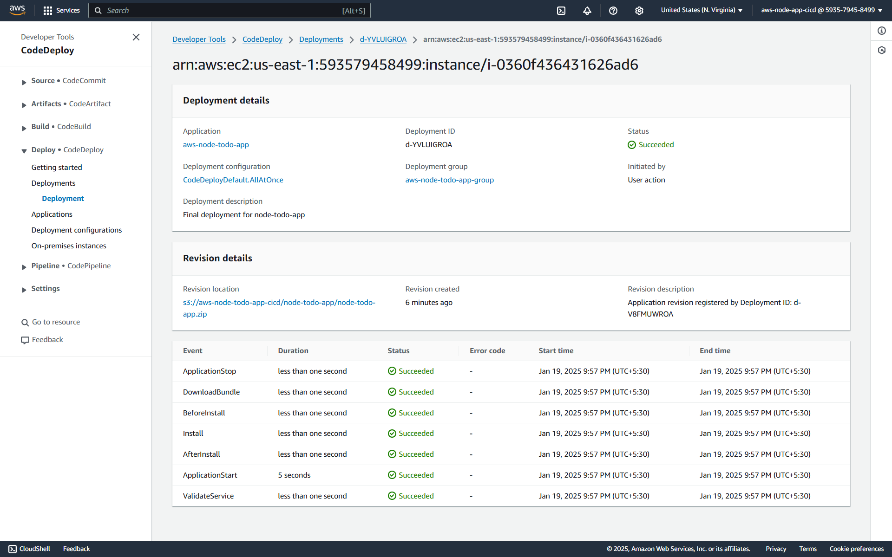
    
* Modifying Inbound rule of Instance to see WebPage on port `8000`:
    
    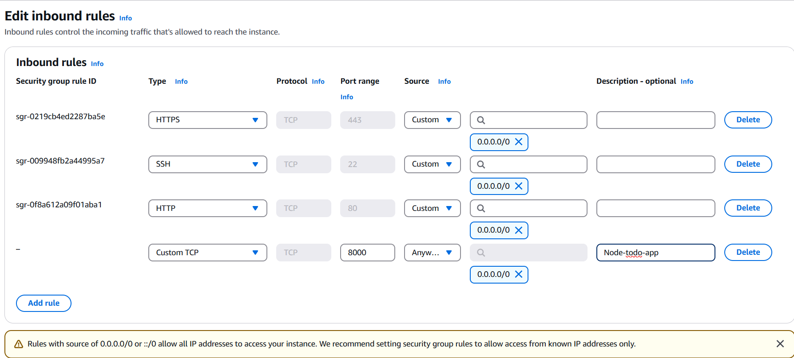
    
* Output image of application :
    
    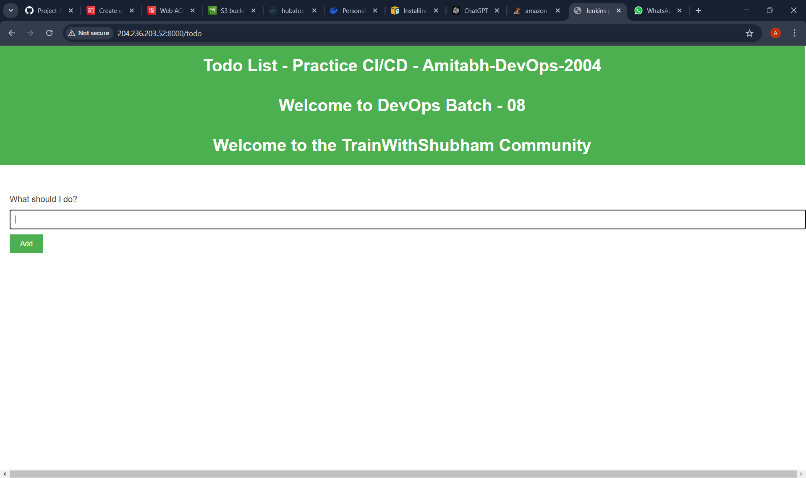
    

---

## **Step 6: Set Up AWS CodePipeline**

Now, we’ll set up AWS CodePipeline to automate the entire CI/CD process. This is the core service that will tie together your GitHub, CodeBuild, and CodeDeploy configurations.

### **Create the Pipeline**

1. Open the **CodePipeline Management Console** and click **Create pipeline choose Build custom pipeline**.
    
2. Provide a name for your pipeline (e.g., `NodeAppPipeline`).
    
3. 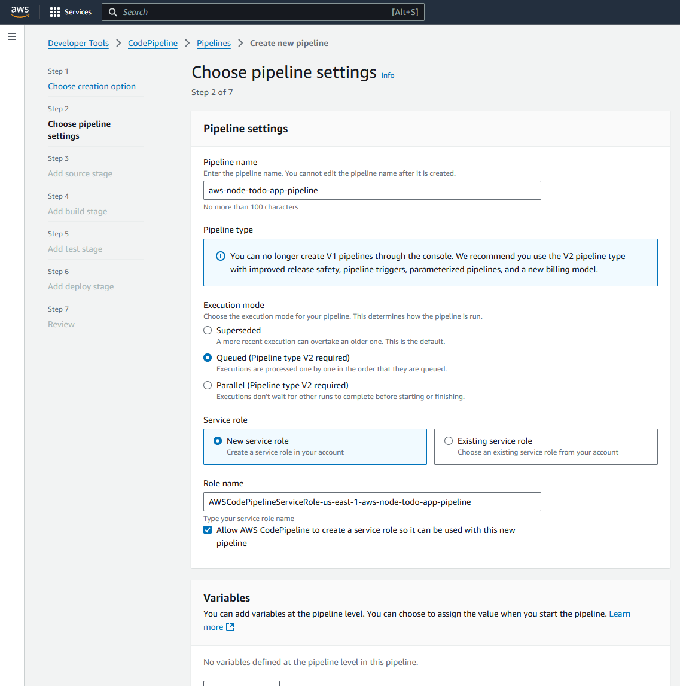
    

### **Configure Source Stage**

1. Select **GitHub** as the source provider.
    
2. Authenticate with GitHub and select your repository (`Project-03-Jenkins-CI-CD-Project-Todo-node-app`) and branch (`feat/awscicd`).
    
3. 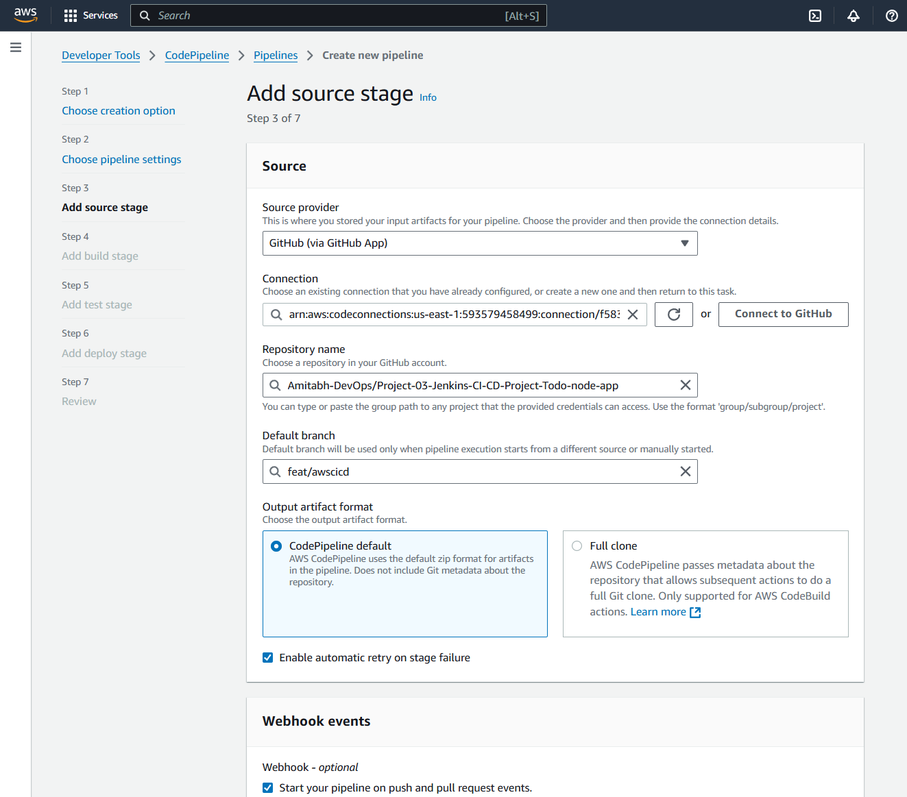
    

### **Configure Build Stage**

1. Select **AWS CodeBuild** as the build provider.
    
2. Choose the build project (`nodejs-build-project`) that was created earlier.
    
3. 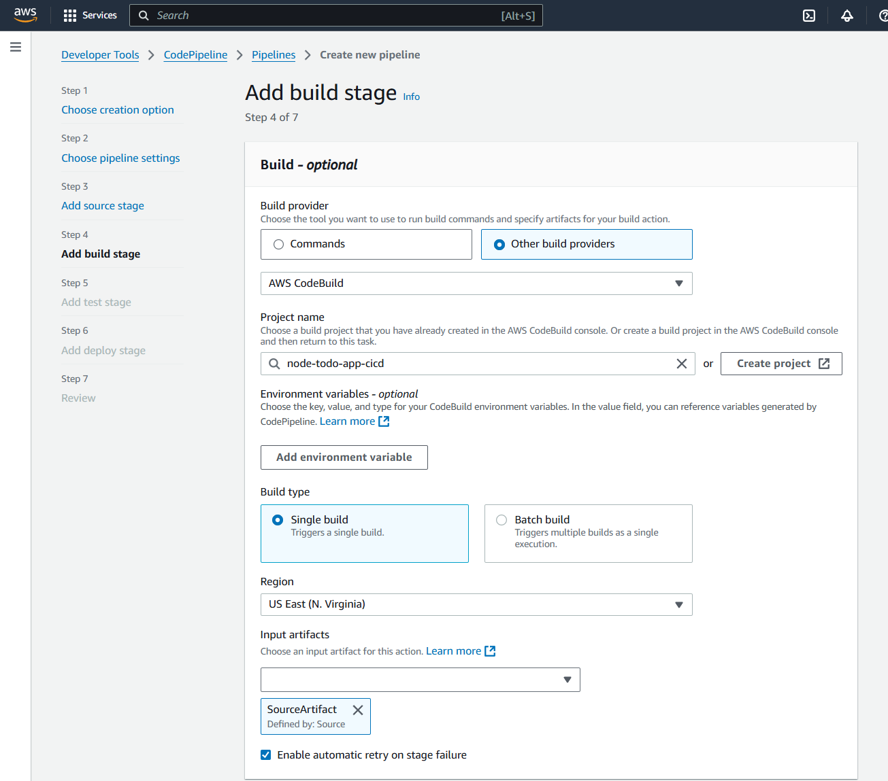
    

### **Configure Deploy Stage**

1. Select **AWS CodeDeploy** as the deployment provider.
    
2. Choose the application and deployment group created earlier.
    
3. 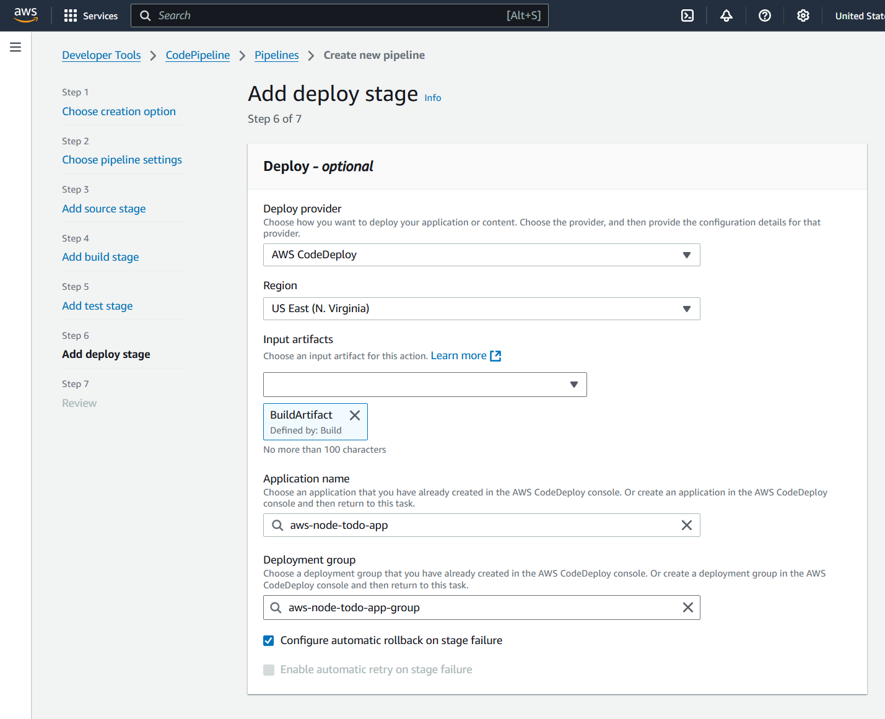
    

### **Finalize and Test**

1. Review all stages and click **Create pipeline**.
    
2. Trigger the pipeline by committing changes to the GitHub repository.
    
    1. Making commit:
        
        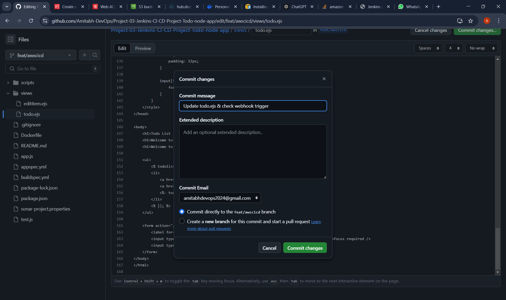
        
    2. Checking auto Trigger :
        
        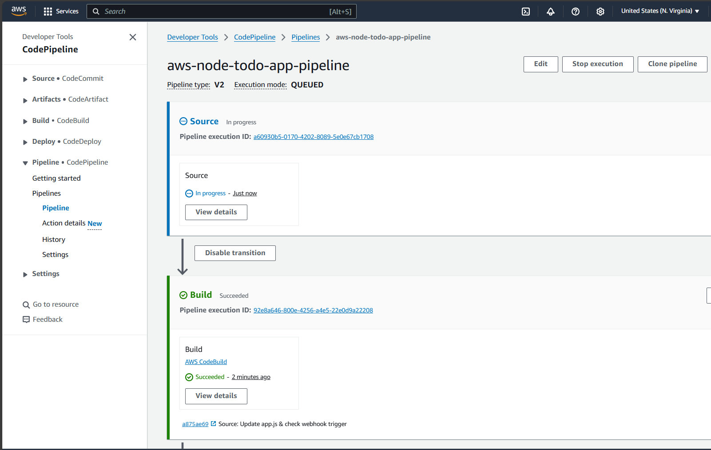
        
    3. Pipeline success:
        
        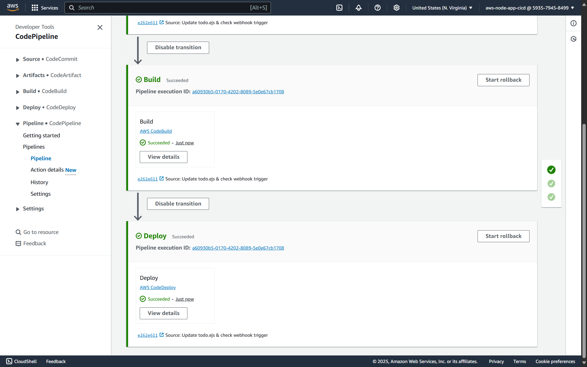
        
3. Monitor the pipeline execution in the **CodePipeline** console.
    
4. **Verify the Deployment**
    
    * Once the pipeline completes, navigate to the public IP address of your EC2 instance and ensure that the Node.js application is running.
        
    * The app should be accessible on port **8000**.
        
    * New look of Applicaton :
        
        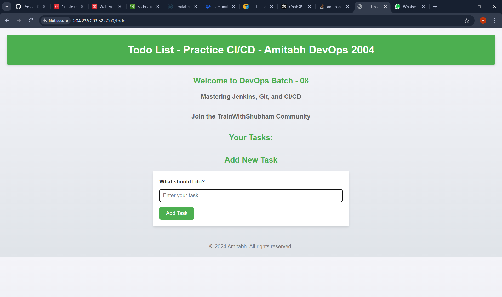
        
    * Checking it’s feature by adding task:
        
        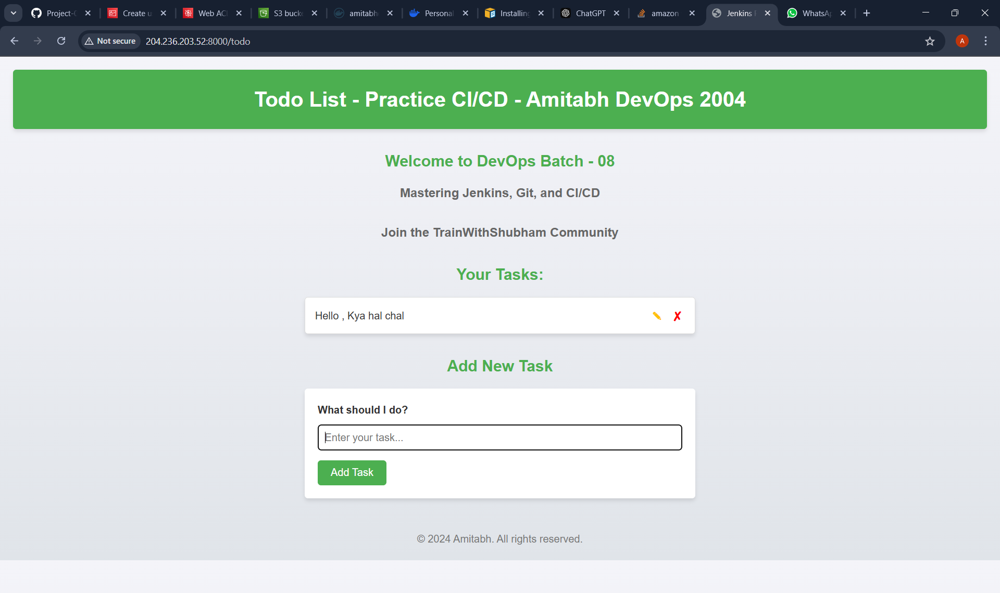
        

---

## **Conclusion**

By following these steps, you’ve successfully set up a fully automated CI/CD pipeline using AWS services like **CodePipeline**, **CodeBuild**, **CodeDeploy**, and **S3** for artifact storage. Now, every time you push changes to the `feat/awscicd` branch of your GitHub repository, the pipeline will automatically trigger, build, and deploy your Node.js application to the EC2 instance.

This CI/CD pipeline allows for faster development cycles, more consistent deployments, and less manual intervention. You can further enhance this pipeline by adding tests, notifications, or using DockerHub for containerized deployments.

---